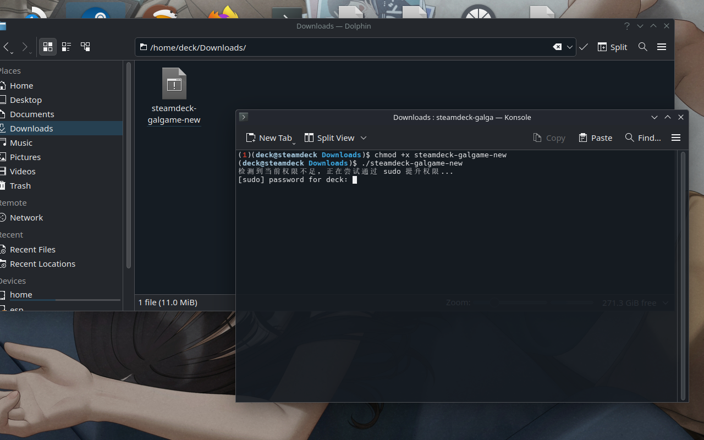
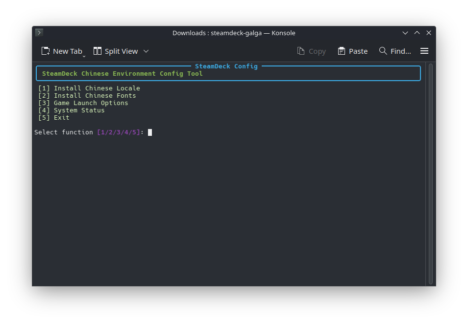

# SteamDeck 中文环境配置工具

为 SteamDeck 配置中文游戏环境的工具。

## 快速开始 
1. 下载最新版本：[RELEASE](https://github.com/yikolemon/easy-steamdeck-galgame/tags)

2. 上传至SteamDeck内

3. `chmod +x steamdeck-galgame`

4. `./steamdeck-galgame`启动

5. 输入密码（需要先手动创建用户并设置密码）

   


6. 使用：
   


## 项目结构

```
src/
├── tui/               # TUI 界面
├── core/              # 核心业务逻辑
└── utils/             # 工具函数
```


# TODO

- [ ] 多语言环境安装：
  - [x] Chinese
  - [ ] Japanese
- [ ] 非Steam游戏附带属性导入


