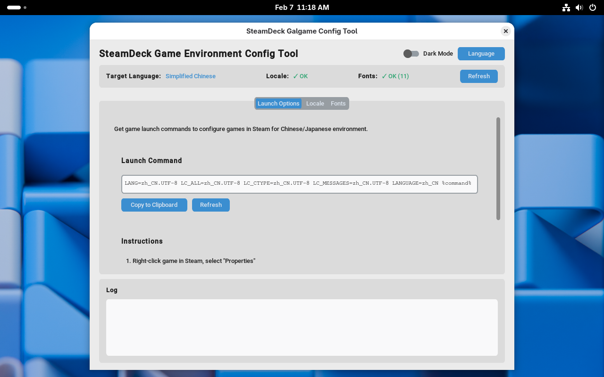

# SteamDeck Localization Helper

A GUI tool and core utilities to configure Chinese/Japanese game environments on SteamOS. It helps install locale packs, fonts, and generate Proton launch options for visual novels and other localized games.

- Badges:  

[简体中文 ](./README.md) |  English

Screenshot
---------

App UI preview:



Installation
------------

Two common ways: download a Release binary or run from source.

- From [Release](https://github.com/yikolemon/easy-steamdeck-galgame/releases)  (recommended for end users)
  1. Download the archive or executable from the Releases page
  2. Extract and follow the included instructions

- From source (for developers / debugging)
  ```bash
  # install dependencies
  pip install -r requirements.txt
  
  # run the app
  python run.py
  ```

Usage
-----

Basic flow:

1. Start the app: `python run.py` or run the packaged binary
2. Choose target language (Chinese / Japanese)
3. Install locale packages as instructed
4. Install or copy fonts to the system fonts directory
5. Copy or generate Proton launch properties for the game
6. Add the game in Steam as a non-Steam shortcut and set the launch options

Features
--------

- Step-by-step GUI wizard for localization tasks
- Automatic font download and system installation
- Proton launch option generation to fix rendering issues
- Batch operations and logging for easier debugging and rollback
- Packable into a standalone executable with PyInstaller

Requirements
------------

- Target platform: SteamDeck / SteamOS (Arch Linux based)
- Python 3.7+
- Root privileges required for system font installation or modifications (may require `steamos-readonly` on SteamOS)
- See `requirements.txt` for Python dependencies

Build from Source
-----------------

```bash
# install dependencies
pip install -r requirements.txt

# run tests
pytest -v --tb=short

# build executable (Linux only)
./build_pyinstaller.sh release
# or directly
BUILD_TYPE=release pyinstaller --clean steamdeck_galgame.spec
```

Project structure
-----------------

```
steamdeck-galgame/
├── run.py
├── src/
│   ├── gui/
│   ├── core/
│   │   ├── installers/
│   │   └── downloader/
│   ├── utils/
│   └── config/
├── tests/
└── doc/
```

License
-------

This project is intended to be MIT licensed. 
